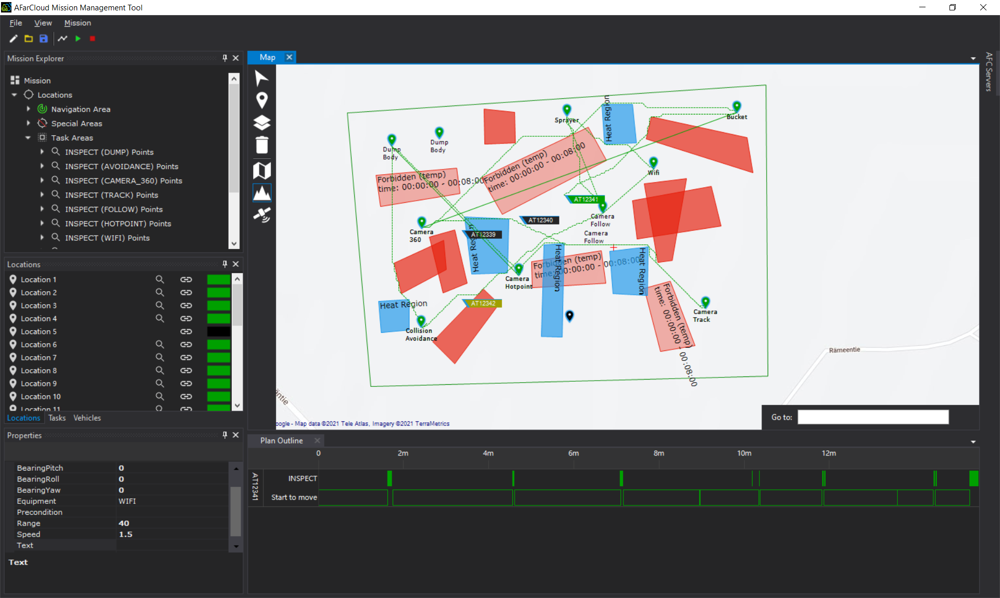

# Demo

The demo is for showing the basic function of MALTA. One can load the demo into MALTA by opening a file in MMT, and choose "demo". This demo shows the basic function of mission planning: planning the sequential execution of task 1 - task 6, being carried at 6 milestones, as well as the paths that visit these milestones and circumvent the obstacles (i.e., red squares).

Mission planning result of the demo:

# Introduction of experiments

Experiment "exp-v1" is much more complex than the demo. This mission contains 11 tasks being allocated to 10 milestones, which means two task (i.e., INSPECT (DUMP)) are located at two milestones (i.e., locations 1 and 2). These milestones have the same device located (i.e., a dumpbody), and thus, the agents only need to choose one to execute the corresponding task. 

Mission planning result of the exp-v2:

Experiment "exp-v2" is even more complex than "exp-v1", which contains temporary obstacles, heatmaps that indicate crowed areas, or areas with bad road conditions. The path-planning should calculate paths that avoid the temporal obstacles when the original path plans go across them when they are stil existing in the map. The planned path should also avoid the heatmaps when traveling through them costs longer time than avoiding them.

Mission planning result of the exp-v2:

Travelling from "Camera Hotpoint" to the "Dump body" on the west goes across a heatmap and a temporary forbidden area. This is because although going through the heatmap slows down the agent, it still costs less time than avoiding the heatmap. Moreover, the temporary forbidden area exists between 00:00:00 to 00:08:00. By the time when the agent goes across the forbidden area, it has disappeared already. 

Experiment "special use case" is a special industrial use case of an autonomous quarry. One can find the detailed description of this mission in our paper.

# Run your own experiments

One can modify the parameters in the mission files (e.g., demo) that we provided, or create your own mission files. You can specify the existing time of all the areas in the map. The existing time of the navigation area requires the mission planner to generate a mission plan that finishes all the task at least once within this period. The existing time of special areas influences the path plans. You are encouraged to play with it or test your own applications.
