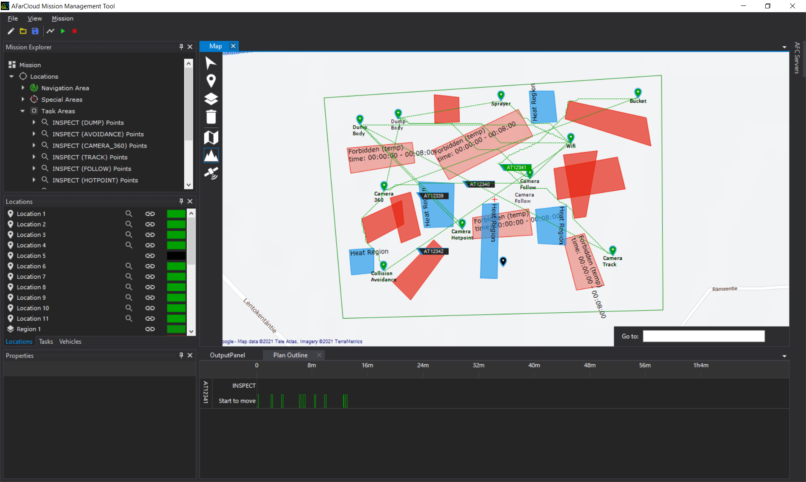

# MALTA
MALTA is a tool chain for mission planning of autonomous agents. It is consisted of three components: front-end, middleware, and back-end. One must install the front-end and middleware locally, and deploy the back-end remotely or locally, to run the entire tool chain.

# Front-end: MMT
Please follow the instructions below to install MMT.

# Middleware
The middleware of MALTA is for path planning and model generation. Please refer to [Middleware](https://github.com/rgu01/TAMAA-DALi) for detailed instruction of deploying and using the middleware.

# Back-end: TAMAA
The back-end of MALTA is for task scheduling by verifying a reachability property in [UPPAAL](https://uppaal.org/). Please refer to [TAMAA](https://github.com/rgu01/TAMAA) for detailed instruction of deploying and using the back-end.

# User Manual
**Step 1**: To run MALTA, one must first start the front-end in Windows:

**Step 2**: After configuring the environment, vehicles, etc., one can start the middleware by running the source code in eclipse, or clicking the executable jar of the middleware. The the connection to the front-end is started by default. One can disconnect by clicking the "Stop" button, and reconnect by clicking the "Start" button. To exit safely, one should click the "Exit" button.

**Step 3**: Start the back-end. One can use a local virtual machine of Linux as the back-end, or a remote server of Linux. Please specify the IP address of the local virtual machine or the remote server according to the instruction in [TAMAA](https://github.com/rgu01/TAMAA).

**Step 4**: Click the "plan" button in the front-end to start the mission planning.

After a while, a mission plan is synthesized and shown in the GUI:

If the configure does not have a valid mission plan, the GUI shows:

# Feedback

Any feedback of the tool is appreciated. Please contact: 

- Rong Gu: rong.gu at mdh.se
- Afshin Ameri: afshin.ameri at mdh.se
- Eduard Baranov: eduard.baranov at uclouvain.be

# Reference
[1]. Rong Gu and Eduard Paul Enoiu and Cristina Seceleanu. TAMAA: UPPAAL-based Mission Planning for Autonomous Agents. The 35th ACM/SIGAPP Symposium On Applied Computing. 2019. ([PDF](http://www.es.mdh.se/publications/5685-TAMAA__UPPAAL_based_Mission_Planning_for_Autonomous_Agents))
