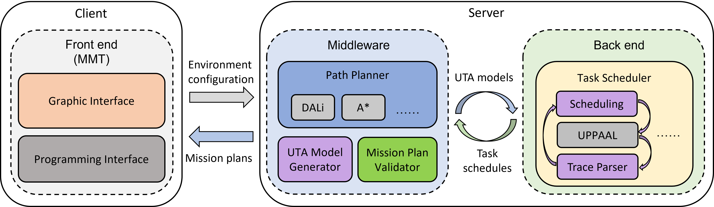

# MALTA
MALTA is a tool chain for mission planning of autonomous agents. It is consisted of three components: front-end, middleware, and back-end. One must install the front-end and middleware locally, and deploy the back-end remotely or locally, to run the entire tool chain.

# Front-end: MMT
Please follow the instructions below to install MMT.

Download and install MMT from [MMT Installer](https://github.com/rgu01/MALTA/tree/main/MMT%20Installer) folder. The installation is straightforward and requires you to press "Next" several times.

In order for MMT to communicate with the planners you will need to set correct server name/ip and ports in the settings dialog in MMT. You can find it under View->Settings.

You are only interested in the following:
- MMT Server Port
- Planner Server Name/IP
- Planner Server Port

Please note that it is possible to define several planners. In such cases the results of the first planner are automatically forwarded to the 2nd planner. At the moment the 3rd planner is not used.

# Middleware
The middleware of MALTA is for path planning and model generation. Please refer to [Middleware](https://github.com/rgu01/TAMAA-DALi) for detailed instruction of deploying and using the middleware.

# Back-end: TAMAA
The back-end of MALTA is for task scheduling by verifying a reachability property in [UPPAAL](https://uppaal.org/). Please refer to [TAMAA](https://github.com/rgu01/TAMAA) for detailed instruction of deploying and using the back-end.

# User Manual
**Step 1**: To run MALTA, one must first start the front-end in Windows:

**Step 2**: After configuring the environment, vehicles, etc., one can start the middleware by running the source code in eclipse, or clicking the executable jar of the middleware. The the connection to the front-end is started by default. One can disconnect by clicking the "Stop" button, and reconnect by clicking the "Start" button. To exit safely, one should click the "Exit" button.

**Step 3**: Start the back-end. One can use a local virtual machine of Linux as the back-end, or a remote server of Linux. Please specify the IP address of the local virtual machine or the remote server according to the instruction in [TAMAA](https://github.com/rgu01/TAMAA).

**Step 4**: Click the "plan" button in the front-end to start the mission planning.

After a while, a mission plan is synthesized and shown in the GUI:

If the configure does not have a valid mission plan, the GUI shows:

# Debug your mission plan

Based on the visuable results, you can debug your mission plans. For example:

**Situation 1**: When your path-finding result returns a path that is not the shortest between two milestones, a gap of movement in the plan outline can be shown:

The gap exists because the task scheduler schedules two consecutive movement:

In this model, moving from P4 to P5 takes 89 time units, where moving from P3 to P4 and then to P5 takes 31 + 56 = 87 time units. Therefore, the path P4->P5 is longer than the deviation P3->P4->P5. This reflects the path-finding algorithm does not find the shortest path, because the direction connections between every two locations in the movement UTA are supposed to be the shortest paths.

# Feedback

Any feedback of the tool is appreciated. Please contact: 

- Rong Gu: rong.gu at mdh.se
- Afshin Ameri: afshin.ameri at mdh.se
- Eduard Baranov: eduard.baranov at uclouvain.be

# Reference
[1]. Rong Gu and Eduard Paul Enoiu and Cristina Seceleanu. TAMAA: UPPAAL-based Mission Planning for Autonomous Agents. The 35th ACM/SIGAPP Symposium On Applied Computing. 2019. ([PDF](http://www.es.mdh.se/publications/5685-TAMAA__UPPAAL_based_Mission_Planning_for_Autonomous_Agents))
